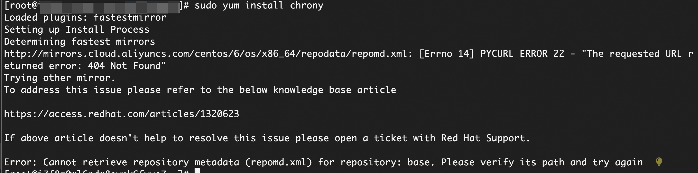

## 问题描述
官方和所有的镜像站（包括您正在使用的阿里云镜像）已经将CentOS 6的软件仓库从常规路径中移除。
<!-- 直接使用普通的  标签 -->



## 解决方案
清理旧的repo配置。

```
sudo mkdir -p /etc/yum.repos.d/backup && sudo mv /etc/yum.repos.d/*.repo /etc/yum.repos.d/backup/
```

创建指向官方存档的新配置。
直接运行下面的命令，它会创建一个新的 CentOS-Vault.repo 文件。

```
sudo tee /etc/yum.repos.d/CentOS-Vault.repo <<'EOF'
[C6.10-base]
name=CentOS-6.10 - Base
baseurl=http://vault.centos.org/6.10/os/$basearch/
gpgcheck=1
gpgkey=file:///etc/pki/rpm-gpg/RPM-GPG-KEY-CentOS-6
enabled=1
[C6.10-updates]
name=CentOS-6.10 - Updates
baseurl=http://vault.centos.org/6.10/updates/$basearch/
gpgcheck=1
gpgkey=file:///etc/pki/rpm-gpg/RPM-GPG-KEY-CentOS-6
enabled=1
[C6.10-extras]
name=CentOS-6.10 - Extras
baseurl=http://vault.centos.org/6.10/extras/$basearch/
gpgcheck=1
gpgkey=file:///etc/pki/rpm-gpg/RPM-GPG-KEY-CentOS-6
enabled=1
EOF
```

清理缓存并重建。

```
sudo yum clean all && sudo yum makecache
```

下载

```
chronysudo yum install chrony
```

